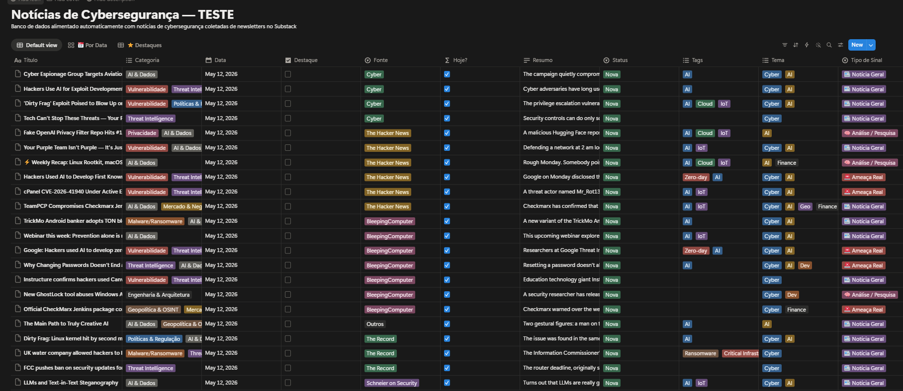
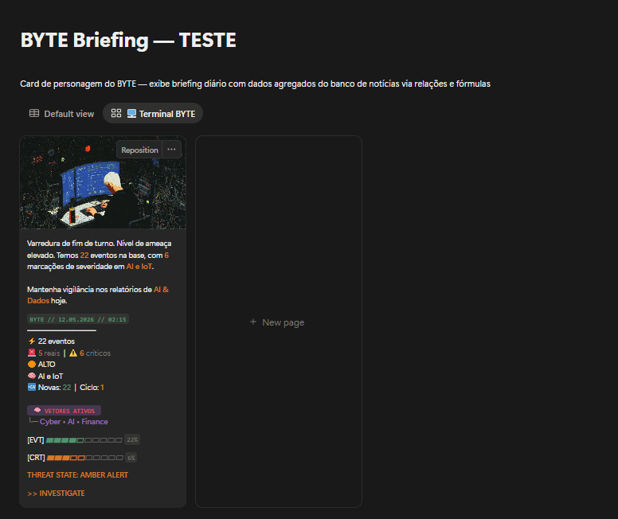
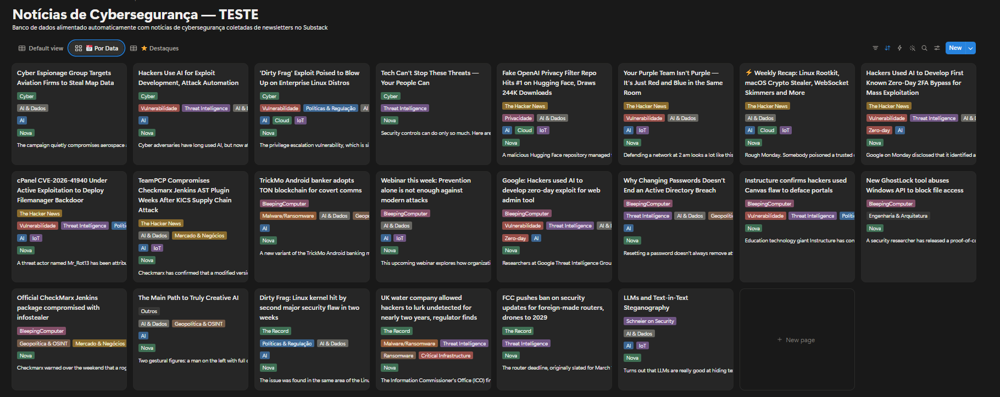

# 🤖 BYTE CyberWatch — Notion Edition

> Repositório público do **BYTE CyberWatch** integrado ao Notion para coleta, organização, classificação e priorização de notícias de cibersegurança.


---

## ⚠️ Aviso de segurança

Este repositório contém uma versão pública e segura do projeto.

Tokens, IDs reais de bancos do Notion e links privados devem ser configurados localmente via `.env` ou nos **Secrets do GitHub Actions**.

Nunca publique:

- `.env`
- tokens do Notion
- chaves de API
- IDs privados sensíveis
- links internos que você não quer expor

Use o arquivo `.env.example` apenas como modelo.

---

## 📌 Sobre o projeto

O **BYTE CyberWatch** é uma automação em Python voltada para monitoramento, organização e priorização de notícias de cibersegurança e tecnologia.

O projeto coleta conteúdos de múltiplas fontes RSS, filtra notícias relevantes por palavras-chave, classifica os itens por categoria, tags, tema e tipo de sinal, envia os registros para um banco de dados no Notion e gera um card diário do BYTE com um briefing executivo do ciclo de monitoramento.

A proposta é transformar notícias dispersas em uma base estruturada de inteligência, facilitando a leitura rápida, a priorização de ameaças e o acompanhamento de temas como vulnerabilidades, ransomware, threat intelligence, inteligência artificial, dados, cloud, IoT, geopolítica e tecnologia.

---

## 🧠 Objetivo

O objetivo do BYTE é transformar excesso de informação em inteligência organizada.

Em vez de salvar links soltos, abrir várias abas ou perder notícias importantes no meio da rotina, o projeto cria um fluxo onde cada notícia coletada vira um registro estruturado, com categoria, tags, resumo, fonte, status, tema e tipo de sinal.

Com isso, o BYTE ajuda a:

- Centralizar notícias de cibersegurança.
- Organizar conteúdos por categoria e tema.
- Identificar possíveis ameaças reais.
- Separar notícias gerais de sinais mais importantes.
- Apoiar estudos em **Cyber Threat Intelligence**.
- Criar uma visão resumida do cenário do dia.
- Facilitar análise e tomada de decisão.

---

## 🖼️ Visão geral do projeto

```text
Fontes externas
RSS, blogs, sites e newsletters
        ↓
Coleta automatizada
Python + feedparser
        ↓
Banco de dados no Notion
Notícias estruturadas
        ↓
Classificação por regras
Categorias, tags, tema e tipo de sinal
        ↓
Card diário do BYTE
Resumo visual e operacional
```

---

## 🔎 O problema

Acompanhar notícias de cibersegurança manualmente exige tempo e organização.

As informações ficam espalhadas em diferentes lugares:

- Blogs de segurança.
- Newsletters.
- Feeds RSS.
- Relatórios técnicos.
- Alertas de vulnerabilidades.
- Notícias sobre ataques.
- Conteúdos sobre IA, dados, IoT, cloud e threat intelligence.

Sem uma estrutura, tudo vira ruído.

O BYTE foi criado para reduzir esse ruído e transformar informação solta em contexto útil.

---

## ⚙️ Como o BYTE funciona

O projeto segue um fluxo dividido em quatro etapas principais.

### 1. Coleta

O BYTE busca notícias em fontes configuradas no arquivo `config/feeds.json`.

Essas fontes podem ser feeds RSS, blogs ou páginas de notícias relacionadas à cibersegurança, tecnologia, dados, IA, geopolítica e mercado.

### 2. Organização

Cada notícia coletada é enviada para um banco de dados no Notion.

No Notion, cada notícia vira um item estruturado, com propriedades que ajudam na leitura, filtragem e análise.

### 3. Classificação

Depois que a notícia é coletada, ela recebe informações de contexto.

A classificação atual é baseada em regras, palavras-chave e contexto.

O BYTE trabalha com:

- Categorias.
- Tags.
- Temas.
- Tipo de sinal.
- Nível de alerta.

### 4. Briefing

Com os dados organizados, o BYTE gera uma leitura resumida do ciclo atual.

Essa leitura funciona como um resumo executivo do cenário monitorado, mostrando volume de eventos, temas em destaque, ameaças críticas e possíveis ações.

---

## 🚀 Funcionalidades

### Coleta e filtragem

- Coleta automática de notícias por RSS Feeds.
- Leitura de múltiplas fontes de cibersegurança, tecnologia, inteligência artificial, dados, geopolítica e mercado.
- Filtragem de conteúdos relevantes por palavras-chave.
- Remoção de conteúdos fora do escopo definido para o projeto.

### Classificação dos conteúdos

- Classificação automática por categoria.
- Geração de tags técnicas e contextuais.
- Identificação de temas dominantes, como Cyber, AI, Dev, Geo e Finance.
- Separação dos conteúdos por tipo de sinal:
  - Notícia Geral.
  - Ameaça Real.
  - Análise / Pesquisa.
  - Conteúdo Educacional.

### Priorização e leitura operacional

- Cálculo de nível de alerta:
  - Baixo.
  - Médio.
  - Alto.
  - Crítico.
- Identificação de itens críticos com base em tags e tipo de sinal.
- Agrupamento dos principais temas do ciclo.
- Geração de uma visão resumida para leitura rápida.

### Integração com Notion

- Envio das notícias para um banco de dados no Notion.
- Criação de registros estruturados com título, resumo, fonte, categoria, tags, tema, status, data e tipo de sinal.
- Relacionamento entre as notícias do dia e o card do BYTE.
- Atualização automática do banco conforme novas notícias são coletadas.

### Card diário do BYTE

- Criação ou atualização automática do card diário do BYTE.
- Geração de resumo executivo.
- Geração da missão do dia.
- Exibição de top threats.
- Exibição do nível de alerta.
- Registro do total de eventos coletados.
- Registro de itens críticos.
- Registro do ciclo de atualização.
- Geração de um terminal raw com visão consolidada do dia.

---

## 🗂️ Estrutura do banco de dados no Notion

O projeto usa dois bancos principais:

1. **Banco de Notícias**
2. **Banco/Card BYTE**

---

## 📰 Banco de Notícias

Cada linha representa uma notícia coletada.

### Propriedades necessárias

| Propriedade | Tipo sugerido | Função |
|---|---|---|
| `Título` | Title | Nome da notícia ou evento principal. |
| `Categoria` | Multi-select | Tipo de conteúdo abordado. |
| `Data` | Date | Data em que a notícia foi registrada. |
| `Destaque` | Checkbox | Indica se a notícia deve receber maior visibilidade. |
| `Fonte` | Select | Origem do conteúdo. |
| `Hoje?` | Checkbox | Propriedade opcional para views e filtros. |
| `Resumo` | Rich text | Síntese da notícia para leitura rápida. |
| `Status` | Select | Estado do item no fluxo. |
| `Tags` | Multi-select | Marcadores técnicos e contextuais. |
| `Tema` | Multi-select | Frente estratégica associada ao conteúdo. |
| `Tipo de Sinal` | Select | Classificação operacional da notícia. |
| `URL` | URL | Link original da notícia. |

> O código escreve diretamente nas propriedades acima.  
> Os nomes precisam estar iguais no Notion.

---

## 🤖 Banco/Card BYTE

O card do BYTE funciona como resumo executivo do ciclo de monitoramento.

### Propriedades necessárias

| Propriedade | Tipo sugerido | Função |
|---|---|---|
| `Agente` | Title | Nome do agente, normalmente BYTE. |
| `Missão do Dia` | Rich text | Mensagem principal do briefing. |
| `Resumo Executivo` | Rich text | Resumo rápido com data, eventos e críticos. |
| `🚨 Critical Link` | Rich text | Link para view de críticos. |
| `Nível de Alerta` | Select | Baixo, Médio, Alto ou Crítico. |
| `Status do Agente` | Select | Estado operacional do BYTE. |
| `Data do Briefing` | Date | Data do card. |
| `Última Atualização` | Date | Última execução do ciclo. |
| `⚡ Events` | Number | Total de eventos coletados. |
| `🚨 Critical` | Number | Total de destaques críticos. |
| `🧠 Top Threats` | Rich text | Principais tags/vetores do ciclo. |
| `Terminal Raw` | Rich text | Relatório consolidado em estilo terminal. |
| `🟢 Novas` | Number | Quantidade de notícias novas. |
| `🔁 Ciclo` | Number | Quantidade de vezes que o card foi atualizado no dia. |
| `🧭 Tema Dominante` | Rich text | Temas mais presentes no ciclo. |
| `🚨 Ameaças Reais` | Number | Quantidade de itens classificados como ameaça real. |
| `🗞️ Notícias Hoje` | Relation | Relação com as notícias do ciclo. |

---

## 🏷️ Categorias usadas

As categorias ajudam a identificar o tipo principal de conteúdo.

### `Vulnerabilidade`

Usada para notícias sobre falhas, CVEs, explorações, correções e riscos técnicos.

### `Threat Intelligence`

Usada para conteúdos ligados a inteligência de ameaças, grupos criminosos, campanhas, TTPs e análise de comportamento adversário.

### `AI & Dados`

Usada para temas envolvendo inteligência artificial, dados, automação, privacidade, modelos de linguagem e riscos associados.

### `Malware/Ransomware`

Usada para notícias sobre malwares, ransomwares, stealers, botnets e ferramentas maliciosas.

### `Políticas & Regulação`

Usada para notícias sobre leis, normas, regulações, decisões governamentais e políticas de segurança.

### `Mercado & Negócios`

Usada para notícias de mercado, empresas, aquisições, investimentos ou impactos financeiros relacionados à segurança.

### `Engenharia & Arquitetura`

Usada para conteúdos sobre desenvolvimento, backend, frontend, arquitetura, APIs e system design.

### `Geopolítica & OSINT`

Usada para conteúdos envolvendo investigação, geopolítica, governos, conflitos e inteligência de fontes abertas.

---

## 🧩 Tags

As tags dão contexto técnico rápido.

| Tag | Uso |
|---|---|
| `AI` | Conteúdos envolvendo inteligência artificial. |
| `IoT` | Dispositivos conectados e internet das coisas. |
| `Cloud` | Ambientes em nuvem. |
| `Zero-day` | Vulnerabilidade ainda sem correção ou explorada antes da divulgação. |
| `Ransomware` | Ataques de sequestro de dados. |
| `Critical Infrastructure` | Infraestrutura crítica. |
| `Dev` | Desenvolvimento, código, bibliotecas ou supply chain. |
| `Finance` | Setor financeiro ou impacto econômico. |
| `Geo` | Contexto geopolítico. |
| `Malware` | Software malicioso, trojans, stealers e variantes. |
| `Phishing` | Campanhas de engenharia social e roubo de credenciais. |
| `OSINT` | Investigação com fontes abertas. |

---

## 🎯 Tema

O campo `Tema` agrupa a notícia em frentes estratégicas mais amplas.

Exemplos:

- `Cyber`
- `AI`
- `Dev`
- `Geo`
- `Finance`
- `Geral`

Enquanto a categoria explica o tipo do conteúdo, o tema mostra a área estratégica relacionada.

---

## 🚨 Tipo de Sinal

O `Tipo de Sinal` ajuda a diferenciar o nível de atenção que uma notícia merece.

### `📰 Notícia Geral`

Conteúdo informativo, útil para contexto, mas que não exige ação imediata.

### `🚨 Ameaça Real`

Conteúdo que pode representar risco mais direto ou exigir atenção prioritária.

### `🧠 Análise / Pesquisa`

Conteúdo mais analítico, técnico ou investigativo.

### `🎓 Conteúdo Educacional`

Conteúdo usado para estudo, guias, tutoriais ou aprendizado.

---

## 🛠️ Tecnologias e conceitos usados

- Python
- Notion API
- RSS Feeds
- GitHub Actions
- feedparser
- python-dotenv
- Regras por palavras-chave
- Cyber Threat Intelligence
- Organização de dados
- Briefing operacional

---

## 📁 Estrutura do repositório

```text
BYTE-CYBERWATCH---NOTION/
│
├── .github/
│   └── workflows/
│       └── byte.yml
│
├── assets/
│   └── .gitkeep
│
├── config/
│   └── feeds.json
│
├── .env.example
├── .gitignore
├── README.md
├── requirements.txt
└── cyber_watcher.py
```

---

## ✅ Pré-requisitos

Antes de rodar o projeto, você precisa ter:

- Python 3.10 ou superior.
- Uma conta no Notion.
- Uma integração criada no Notion.
- Um banco de notícias no Notion.
- Um banco/card BYTE no Notion.
- Token da integração do Notion.
- IDs dos bancos do Notion.

---

## 🔐 Variáveis de ambiente

Crie um arquivo `.env` local com:

```env
NOTION_TOKEN=
NOTION_DATABASE_ID=
NOTION_BYTE_DB_ID=
CRITICAL_VIEW_URL=
```

### Explicação

| Variável | Função |
|---|---|
| `NOTION_TOKEN` | Token da integração do Notion. |
| `NOTION_DATABASE_ID` | Data Source ID do Banco de Notícias. |
| `NOTION_BYTE_DB_ID` | Data Source ID do Banco/Card BYTE. |
| `CRITICAL_VIEW_URL` | Link opcional para a view de críticos. |

---

## 🧱 Como configurar o Notion

### 1. Criar integração

1. Crie uma integração no Notion.
2. Copie o token da integração.
3. Coloque o valor em `NOTION_TOKEN`.

### 2. Criar o Banco de Notícias

Crie um database no Notion com as propriedades listadas na seção **Banco de Notícias**.

### 3. Criar o Banco/Card BYTE

Crie outro database no Notion com as propriedades listadas na seção **Banco/Card BYTE**.

### 4. Compartilhar os bancos com a integração

Para cada banco:

1. Abra o banco no Notion.
2. Clique em `Share`.
3. Convide a integração criada.
4. Garanta permissão de edição.

Se isso não for feito, o script pode retornar `object_not_found`.

### 5. Copiar os IDs dos bancos

Copie os IDs das URLs do Notion e coloque no `.env`.

---

## ⚙️ Configurando fontes RSS

As fontes ficam em:

```text
config/feeds.json
```

Exemplo:

```json
[
  {
    "name": "The Hacker News",
    "url": "https://feeds.feedburner.com/TheHackersNews",
    "source": "The Hacker News"
  }
]
```

Cada fonte precisa ter:

| Campo | Função |
|---|---|
| `name` | Nome da fonte. |
| `url` | Link do feed RSS. |
| `source` | Nome que aparecerá no Notion. |

---

## 📦 Instalação

Clone o repositório:

```bash
git clone https://github.com/SEU-USUARIO/BYTE-CYBERWATCH---NOTION.git
```

Entre na pasta:

```bash
cd BYTE-CYBERWATCH---NOTION
```

Crie um ambiente virtual:

```bash
python -m venv venv
```

Ative o ambiente virtual.

Windows:

```bash
venv\Scripts\activate
```

Linux/macOS:

```bash
source venv/bin/activate
```

Instale as dependências:

```bash
pip install -r requirements.txt
```

---

## ▶️ Como rodar

Depois de configurar o `.env`, execute:

```bash
python cyber_watcher.py
```

Saída esperada:

```text
🤖 BYTE CyberWatch v2 — Ciclo diário iniciado
Buscando: The Hacker News
Total relevante: X
novas notícias inseridas
Card BYTE criado/atualizado
Concluído
```

---

## 🤖 GitHub Actions

O projeto já inclui um workflow em:

```text
.github/workflows/byte.yml
```

Ele pode rodar automaticamente em horários definidos e também manualmente pelo botão **Run workflow**.

### Secrets necessários

No GitHub, configure:

```text
NOTION_TOKEN
NOTION_DATABASE_ID
NOTION_BYTE_DB_ID
CRITICAL_VIEW_URL
```

Caminho:

```text
Settings → Secrets and variables → Actions → New repository secret
```
---
> Importante: este projeto usa `notion.data_sources.query`, então os valores de `NOTION_DATABASE_ID` e `NOTION_BYTE_DB_ID` devem ser os **Data Source IDs** dos bancos do Notion, não apenas o ID da página ou da view.

> O workflow público vem configurado para execução manual via `workflow_dispatch`, evitando execuções automáticas indesejadas. Caso queira deixar para execuções automaticas siga o exemplo

```on:
  schedule:
    - cron: "0 10,16,23 * * *"
  workflow_dispatch:
```
---

## 🖼️ Screenshots

Adicione suas imagens na pasta `assets/`.

Exemplos:

```markdown



```

---

## 🧩 Possíveis melhorias

- Integrar dados de CVEs.
- Adicionar pontuação de severidade.
- Criar análise de tendências semanais e mensais.
- Melhorar classificação automática dos sinais.
- Criar alertas por nível de criticidade.
- Gerar relatório diário em Markdown.
- Enviar alertas por e-mail, Discord ou Slack.
- Criar dashboard com métricas de categoria e tags.
- Melhorar detecção de duplicidade de notícias.
- Permitir configuração de regras por arquivo externo.

---


## 🤝 Como contribuir

Sugestões, ideias e melhorias são muito bem-vindas.

Você pode contribuir de várias formas:

- Abrindo uma issue.
- Reportando problemas.
- Sugerindo novas fontes.
- Melhorando regras de classificação.
- Criando novas views para o Notion.
- Melhorando a documentação.
- Propondo novas automações.

---

## ⚠️ Limitações

Este projeto é experimental e foi criado com foco em aprendizado, organização de informações e prática de automação aplicada à cibersegurança.

Ele não substitui ferramentas profissionais de Threat Intelligence, SIEM, SOAR ou monitoramento corporativo.

A proposta é estudar, organizar e visualizar sinais de segurança de forma mais estruturada.

---

## 👩‍💻 Autora

Desenvolvido por **Giulia Barros**.

Projeto criado como parte da minha jornada de estudos em cibersegurança, automação e organização de inteligência a partir de fontes abertas.

---

## 📄 Licença

Este projeto pode ser distribuído sob a licença MIT.

Consulte o arquivo `LICENSE` para mais detalhes.

---

## ⭐ Apoie o projeto

Se este projeto te ajudou ou se você achou a ideia interessante, considere deixar uma estrela no repositório.

Feedbacks, sugestões e críticas construtivas são muito bem-vindos.
